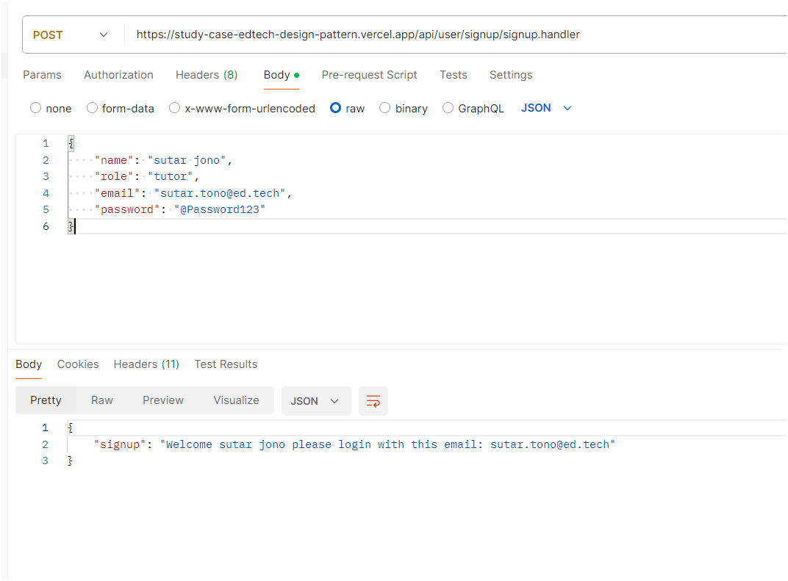
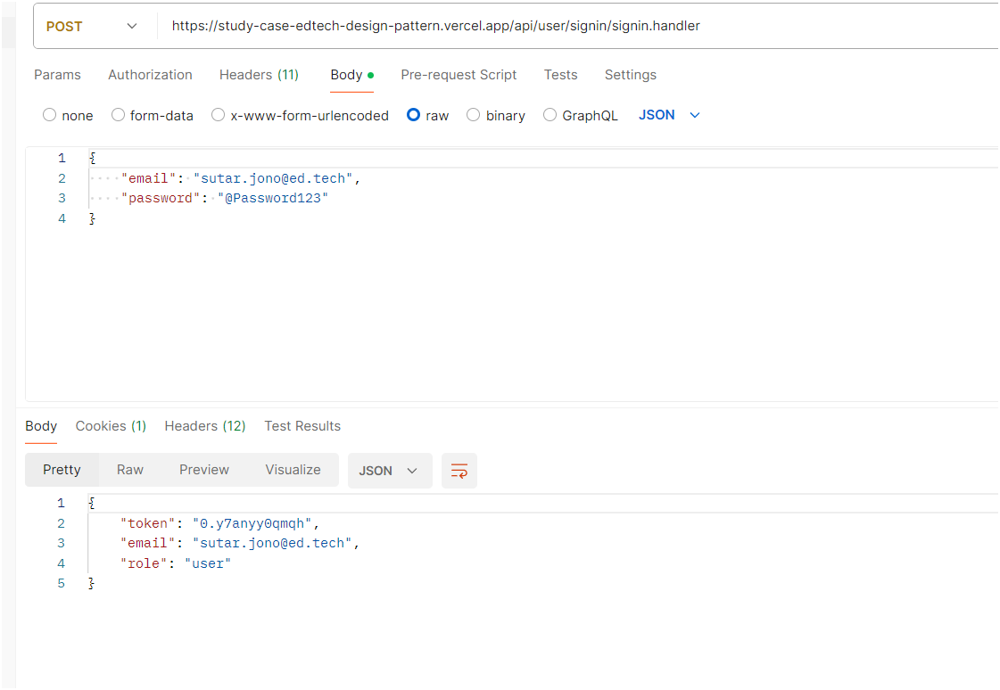
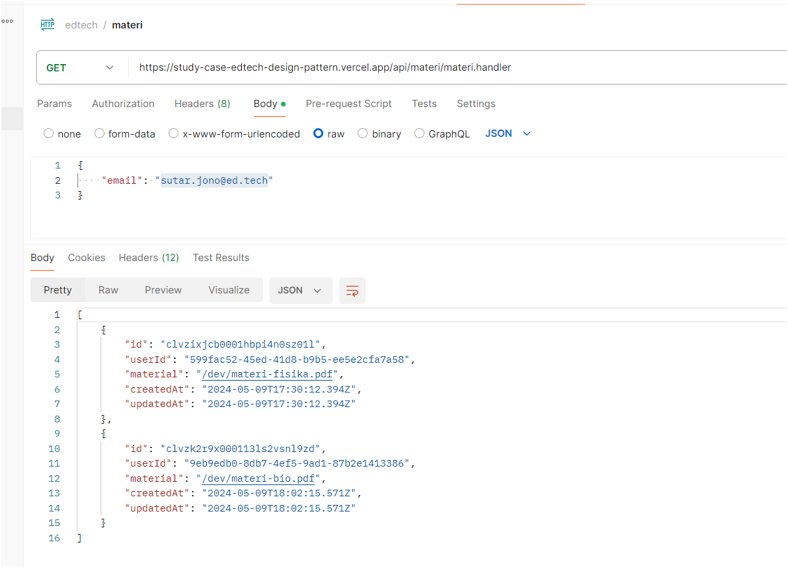
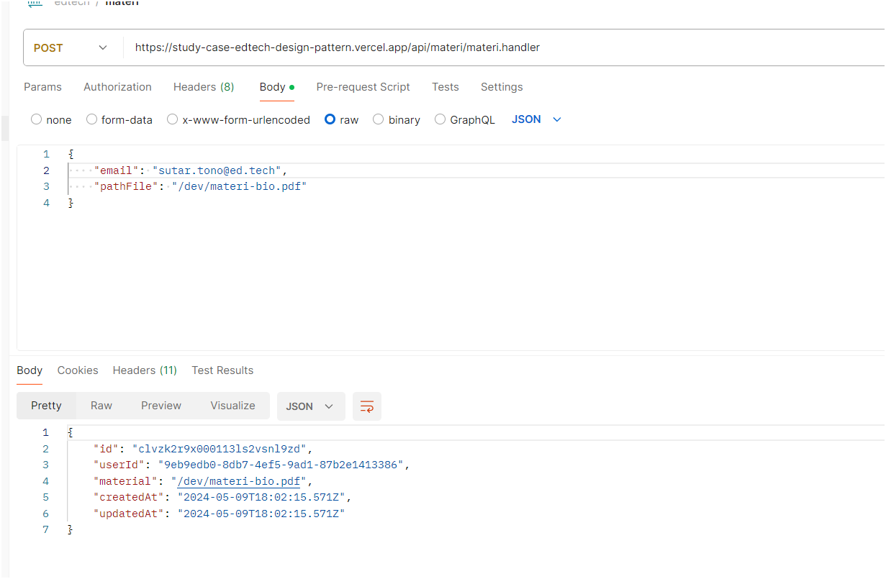

# List API:

- https://study-case-edtech-design-pattern.vercel.app/api/user/signup/signup.handler (METHOD POST)

```
req body = {
    "name": "sutar jono",
    "role": "tutor",
    "email": "sutar.tono@ed.tech",
    "password": "@Password123"
}
```



- https://study-case-edtech-design-pattern.vercel.app/api/user/signin/signin.handler (METHOD POST)

```
req body = {
    "email": "sutar.jono@ed.tech",
    "password": "@Password123"
}
```



- https://study-case-edtech-design-pattern.vercel.app/api/materi/materi.handler (METHOD POST/GET)

```
GET
req body = {
"email": "sutar.jono@ed.tech"
}
```



```
POST
req body = {
    "email": "sutar.tono@ed.tech",
    "pathFile": "/dev/materi-fisika.pdf"
}
```


